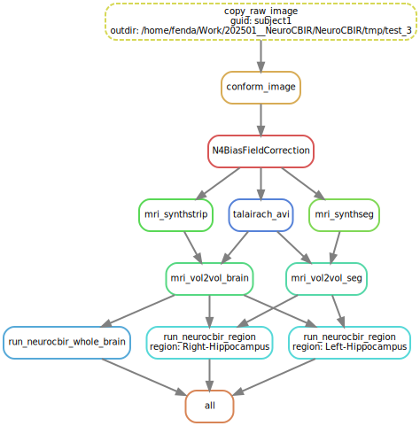

# NeuroCBIR

*A Public Image Retrieval System for Whole-Brain and Region-Specific MRI*

## Overview

**NeuroCBIR** is an open neuroimaging framework for **content-based image retrieval (CBIR)** on structural MRI data.
It supports both **whole-brain** and **region-specific** searches across clinical datasets.

It can be used in multiple ways:

1. **Docker workflow** – run the full pipeline (preprocessing + CBIR) in a reproducible containerized environment.
2. **Snakemake workflow** – execute the same pipeline using Snakemake + Singularity (Apptainer). Allows parallelization.
3. **Python package** – import and extend the NeuroCBIR logic in your own Python workflows.

---

## System Requirements

| Component                         | Minimum Version | Purpose                                      |
| --------------------------------- | --------------- | -------------------------------------------- |
| **Python**                  | ≥ 3.10         | For setup and optional local runs            |
| **Docker**                  | ≥ 24.0         | For the default containerized workflow       |
| **Apptainer / Singularity** | ≥ 1.2          | For Snakemake-based workflow parallelization |
| **Git**                     | Any recent      | To clone the repository                      |

---

## Required Data

NeuroCBIR relies on pre-trained model weights and embedding datasets. These files must be downloaded manually and placed in the `deploy/data/data_private/` directory after cloning the repository. You can obtain the required files from the [releases](https://github.com/minnelab/NeuroCBIR/releases) page.

The expected directory structure is:

```
deploy/data/
└── data_private/
    ├── region_brain/
    │   ├── cl_ckpt.pth
    │   ├── projected_embeddings.parquet
    │   └── vae_ckpt.pth
    └── whole_brain/
        ├── cl_ckpt.pth
        ├── projected_embeddings.parquet
        └── vae_ckpt.pth
```

---

## Setup

Clone the repository and prepare the environment:

```bash
git clone https://github.com/feniede/NeuroCBIR.git
cd NeuroCBIR
chmod +x setup.sh
chmod +x run_neurocbir.sh
```

Run the setup script corresponding to your workflow:

### Docker Mode

```bash
./setup.sh docker
```

### Snakemake Mode

```bash
./setup.sh snakemake
```

These scripts will:

- Check for required dependencies (Docker, Python, Singularity, etc.)
- Build or pull necessary containers
- Prepare configuration files
- Validate the installation

---

## Usage

Full explanation on how to use each of the NeuroCBIR workflows can be found in:

```bash
./run_neurocbir.sh --help
```

### Run with Docker

```bash
./run_neurocbir.sh docker --help
```

### Run with Snakemake

```bash
./run_neurocbir.sh snakemake --help
```

This is the resulting snakemake parallelized workflow:

<p align="center">
  
</p>

The figure above illustrates the Snakemake workflow for the NeuroCBIR pipeline, including preprocessing and retrieval stages.

---

## Reproducibility

To fully reproduce the NeuroCBIR pipeline, including training, evaluation, and experiments, see `dev/README.md`.

---

### Shared Derived Features

This repository provides precomputed features for each MRI image in the OASIS3, AIBL, MIRIAD and SLIM datasets. For each image, the following are included:

- `image_id`: The OASIS3, AIBL, MIRIAD and SLIM image-level identifier (e.g., OAS30001_MR_d0123)
- Derived features: numeric representations extracted from the MRI

**Important:** These features alone cannot be used to identify any subject. Linking these features to clinical or imaging data requires **authorized access to the original dataset**. This sharing is intended to allow reproducibility of our analysis and pipeline.

---

## Contact

Félix Nieto-del-Amor¹, Jingru Fu²¹, J.-Sebastian Muehlboeck², Eric Westman²,  Daniel Ferreira²⁴, Rodrigo Moreno¹³

¹ Division of Biomedical Imaging, KTH Royal Institute of Technology
² Athinoula A. Martinos Center for Biomedical Imaging, Massachusetts General Hospital and Harvard Medical School, MA, USA.
³ Division of Clinical Geriatrics, Karolinska Institute
⁴ Facultad de Ciencias de la Salud, Universidad Fernando Pessoa Canarias, Santa María de Guía, Las Palmas, Spain.

For questions or support, contact **Félix Nieto-del-Amor** at: fenda@kth.se

---
