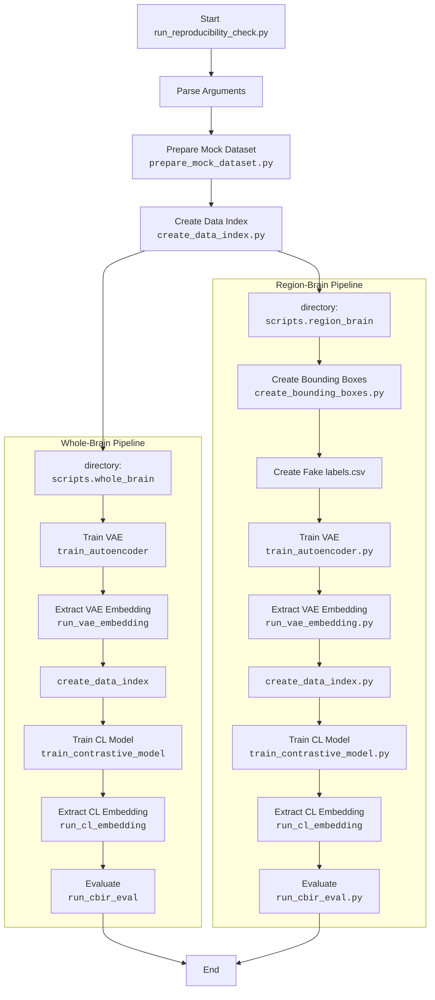

# NeuroCBIR development

*NeuroCBIR: A Public Image Retrieval System for Whole-Brain and Region-Specific MRI.*

---

## Overview

**NeuroCBIR** is an open neuroimaging framework for **content-based image retrieval (CBIR)** on structural MRI data.
It supports both **whole-brain** and **region-specific** searches across clinical datasets.

This sections is only focused on reaching reproducible results.

---

## Whole-brain

### VAE-training

