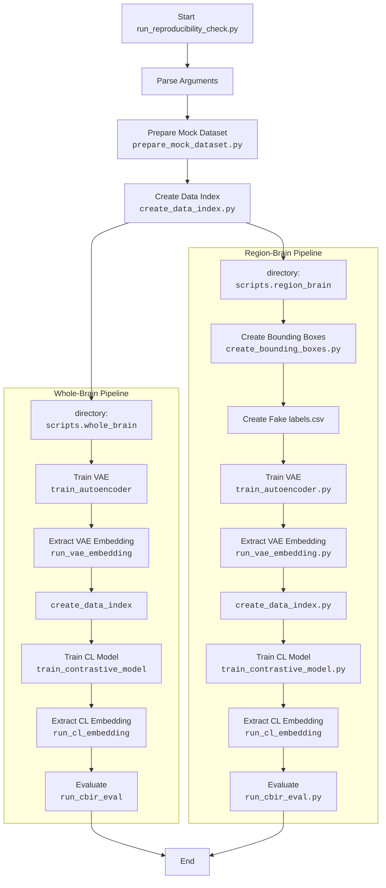

# NeuroCBIR development

*NeuroCBIR: A Public Image Retrieval System for Whole-Brain and Region-Specific MRI.*

---

# Overview

**NeuroCBIR** is an open neuroimaging framework for **content-based image retrieval (CBIR)** on structural MRI data.
It supports both **whole-brain** and **region-specific** searches across clinical datasets.

This sections is only focused on reaching reproducible results.

---

# Dataset Structure Requirements (Real T1w MRI Dataset)

This project expects a T1-weighted brain MRI dataset organized in a specific structure. The following specification describes how the real dataset must be formatted, based on the mock dataset generator used in this repository.

## Directory Layout

The dataset root must contain:

```
dataset_root/
│
├── original/
│   ├── batched_ADNI/
│   │   ├── batch_0001.npz
│   │   ├── batch_0002.npz
│   │   └── ...
│   │
│   ├── batched_OASIS3/
│   │   ├── batch_0001.npz
│   │   └── ...
│   │
│   └── (other dataset sources, optional)
│
└── metadata.csv
```

Each subdirectory inside `original/` corresponds to a dataset source (e.g., ADNI, OASIS3).  
Each of these contains multiple batched `.npz` files.

## NPZ Batch File Structure

Each file `batch_XXXX.npz` must contain three arrays:

| Array name      | Shape               | Description                                                   |
|-----------------|---------------------|---------------------------------------------------------------|
| images          | (N, C, H, W, D)     | T1-weighted MRI volumes stored as float32                    |
| segmentations   | (N, C, H, W, D)     | Segmentation masks or brain masks (dtype uint8 or int)       |
| GUID            | (N,) object dtype   | Unique identifiers for each scan                              |

All MRI volumes must share the same shape within a batch.  
Images are expected to be pre-processed (or pre-aligned) so that they can be stacked into a single array.

## metadata.csv Format

A file named `metadata.csv` must be located at the dataset root.  
It must contain one row per MRI sample, with the following columns:

| Column          | Description |
|-----------------|-------------|
| GUID            | Unique scan identifier, matching the GUID inside the `.npz` files |
| project         | Dataset source (e.g., ADNI, OASIS3) |
| subject         | Subject identifier |
| timepoint       | Scan session identifier |
| scan_type       | Type of scan, e.g., "T1" |
| field_strength  | MRI field strength (e.g., 1.5, 3.0) |
| manufacturer    | Scanner vendor name |
| model_name      | Scanner model |
| disease         | Diagnosis label (CN, MCI, AD, etc.) |
| age             | Subject age |
| partition       | train / val / test |
| brain_qc        | QC score between 0 and 1 |

Additional columns may be included, but these fields must exist.

## Requirements and Notes

- The real dataset must replicate the same structural logic used in the mock dataset.
- Batch NPZ files must contain stacked MRI volumes and segmentation masks.
- The `GUID` field is the primary link between batch files and the metadata table.
- Any real dataset must be converted into this format before being processed by the pipeline.

## Synthetic Dataset Generator (`prepare_mock_dataset.py`)

The file `dev/preprocessing/prepare_mock_dataset.py` generates a **fully synthetic example** of the dataset expected by NeuroCBIR. The purpose of this mock dataset is not to resemble real MRI data, but to:

1. Provide a **complete, reproducible dataset** so the entire pipeline can be executed by any user without requiring access to clinical scans.
2. Serve as a **structural template** showing how the real dataset must be organized.

The synthetic generator creates:
    - A directory structure identical to that required by the real dataset.
    - `.npz` batch files containing:
    - `images`: randomly generated 3D MRI-like volumes
    - `segmentations`: randomly generated segmentation masks
    - `GUID`: unique identifiers for each volume
- A `metadata.csv` file defining the expected fields (project, subject, timepoint, scan type, disease label, QC score, etc.).

To switch from synthetic data to real MRI data, simply replace the generated folders and files with your real dataset, maintaining the **same folder hierarchy and metadata schema**. No modification of the rest of the pipeline is required.

---

# Reproducibility Pipeline (`run_reproducibility_check.py`)

The script `dev/run_reproducibility_check.py` implements a **full end-to-end reproducibility pipeline** for NeuroCBIR. It covers every stage needed to train and evaluate the CBIR system:




This pipeline ensures that all steps—from data preparation to final retrieval scores—can be executed automatically.

By default, it uses the synthetic dataset so that any user can run the pipeline immediately.  
To use real data, simply replace the output of `prepare_mock_dataset.py` with your actual dataset following the same structure. The rest of the script will function identically, enabling full reproducibility of the system on real MRI data.

---

# Statistical Analysis and Figure Generation (`dev/notebooks/`)

All statistical tests, evaluation summaries, and figure preparation workflows used in NeuroCBIR are provided as Jupyter notebooks inside the directory: `dev/notebooks/`.


These notebooks serve three key purposes:

1. **Reproduce all quantitative analyses** performed during model development, including:
   - Evaluation of CBIR performance
   - Whole-brain vs. region-based comparison
   - Statistical tests (e.g., paired metrics, significance tests)

2. **Generate all figures used in documentation and publications**, such as:
   - Embedding visualizations  
   - Pipeline diagrams  
   - Performance plots  
   - Regional analysis figures

3. **Provide transparent, step-by-step workflows** that allow users to inspect intermediate data, validate assumptions, and export figures directly.

Because the notebooks depend only on outputs produced by the main pipeline, they work with both:
- The **synthetic dataset** generated by `prepare_mock_dataset.py`, or  
- Your **real MRI dataset**, provided it follows the same structure.

This separation ensures that:
- The main pipeline remains clean and automated.
- All exploratory analysis and figure generation remains easily readable, reproducible, and modifiable by end users.


